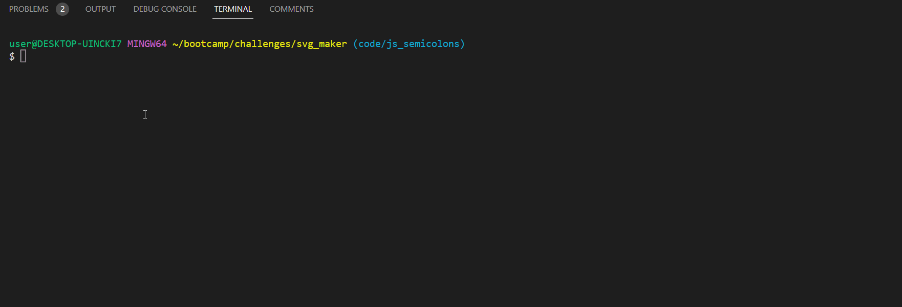

# Custom SVG Generator

  [](https://opensource.org/licenses/MIT)

## Technology Used 🖥️

| Technology Used         | Resource URL           | 
| ------------- |:-------------:| 
| JavaScript | [https://developer.mozilla.org/en-US/docs/Web/JavaScript](https://developer.mozilla.org/en-US/docs/Web/JavaScript)     |  
| Inquirer | [https://github.com/SBoudrias/Inquirer.js/](https://github.com/SBoudrias/Inquirer.js/)     |   
| node.js | [https://nodejs.org/en](https://nodejs.org/en)     |     
| Jest | [https://jestjs.io/](https://jestjs.io/)     |   
| Git | [https://git-scm.com/](https://git-scm.com/)     |   

--------

## Description 📝

Create your own (albeit simple) SVG!

Choose your desired text, shape color, text color and desired shape out of the ones available.

Through the utilization of Node.js, Inquirer, and Jest, this application was able to be created.

* Node.js's preinstalled filesystem module along with the built-in JavaScript runtime environment allowed this project to be executed.
* Inquirer's prompt() method allows the application to take in user inputs and manipulate the SVG file based on said inputs. 
* Jest allowed for me to create test cases for the application and ensure that everything was running properly.



-----------------------

## Table of Contents 📋
* [Learning Points](#learning-points-📖)
* [Installation Instructions](#installation-instructions-📥)
* [Usage Information](#usage-information-✅)
* [Test Instructions](#test-instructions-🧪)
* [Author Info](#author-info-👺)
* [Questions?](#questions-❓)
* [License](#license-🚩)

----------------------

## Learning Points 📖

A major learning point in this project was the usage of class inheritance and TDD.

***Class Inheritance***

Class inheritance is simply creating new instances of a class and that new instance will have the parent's methods and properties.

An example of class inheritance that I used in this application can be seen below:

* Below is the original parent class
``` JavaScript
class Shape { //the parent shape constructor that we'll use to make the other shape classes
    constructor(text, text_color, shape_color){
        this.text = text;
        this.text_color = text_color;
        this.shape_color = shape_color;
    };
};
```
* Below is the child of said parent class inheriting the text, text_color, and shape_color properties
``` JavaScript
class Square extends Shape { //copies the properties of the Shape class from ./shape.js
    constructor(text, text_color, shape_color){
        super(text, text_color, shape_color);
    };
```

***Test Driven Development (TDD)***

TDD is a concept where developers will initially write tests that outline the desired outcome for our code, then write code that passes the test, then refactor the code to make it more efficient and concise and the loop occurs all over again.

Using this concept, I wrote tests that outlined my desired outcomes and wrote code to satisfy those tests. An Example test can be seen below:

```JavaScript
    describe('Circle Text Test',()=>{
        it('The circle text should equal dae', ()=>{ //tests if the circle's text is accurate
            const text = 'dae';
            const testCircle = new Circle(text);
            expect(testCircle.text).toEqual('dae');
        });
    });
```

## Installation Instructions 📥

To install the application, simply download the files or clone this GitHub repo on to your local machine.

To see how to use the application, checkout the section below!

------------------------

## Usage Information ✅

To use the application:
1. Clone this repo or download the files on to your local machine.
2. Open the terminal in the root directory of this app.
3. Download node.js on to your local machine.
4. Run `npm i` or `npm install` in the terminal to download inquirer and jest.
5. Then run `node index.js` and complete the following prompts.
6. Check the `./examples` folder to see your newly `renderedShape.svg`.

Alternatively, [you can watch this video.](https://youtu.be/1DKP59xXzTc)

----------------------

## Test Instructions 🧪

If you'd like to run the tests for this application, simply open the terminal in the root directory of this app and run `npm run test`. 

------------------------

## Author Info 👺

### ***daevidvo***
* [Github](github.com/daevidvo)
* [LinkedIn](linkedin.com/in/daevidvo)
* [Instagram](instagram.com/daevidvo)

--------------------------

## Questions ❓

Email me at: [daevidvo@gmail.com](mailto:daevidvo@gmail.com) or [visit my GitHub](github.com/daevidvo)

------------------------

## License 🚩

https://opensource.org/licenses/MIT


The MIT License (MIT)
=====================

Copyright © daevidvo

Permission is hereby granted, free of charge, to any person
obtaining a copy of this software and associated documentation
files (the “Software”), to deal in the Software without
restriction, including without limitation the rights to use,
copy, modify, merge, publish, distribute, sublicense, and/or sell
copies of the Software, and to permit persons to whom the
Software is furnished to do so, subject to the following
conditions:

The above copyright notice and this permission notice shall be
included in all copies or substantial portions of the Software.

THE SOFTWARE IS PROVIDED “AS IS”, WITHOUT WARRANTY OF ANY KIND,
EXPRESS OR IMPLIED, INCLUDING BUT NOT LIMITED TO THE WARRANTIES
OF MERCHANTABILITY, FITNESS FOR A PARTICULAR PURPOSE AND
NONINFRINGEMENT. IN NO EVENT SHALL THE AUTHORS OR COPYRIGHT
HOLDERS BE LIABLE FOR ANY CLAIM, DAMAGES OR OTHER LIABILITY,
WHETHER IN AN ACTION OF CONTRACT, TORT OR OTHERWISE, ARISING
FROM, OUT OF OR IN CONNECTION WITH THE SOFTWARE OR THE USE OR
OTHER DEALINGS IN THE SOFTWARE.
